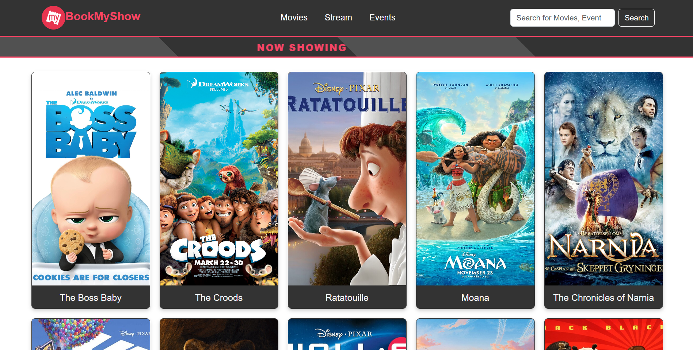
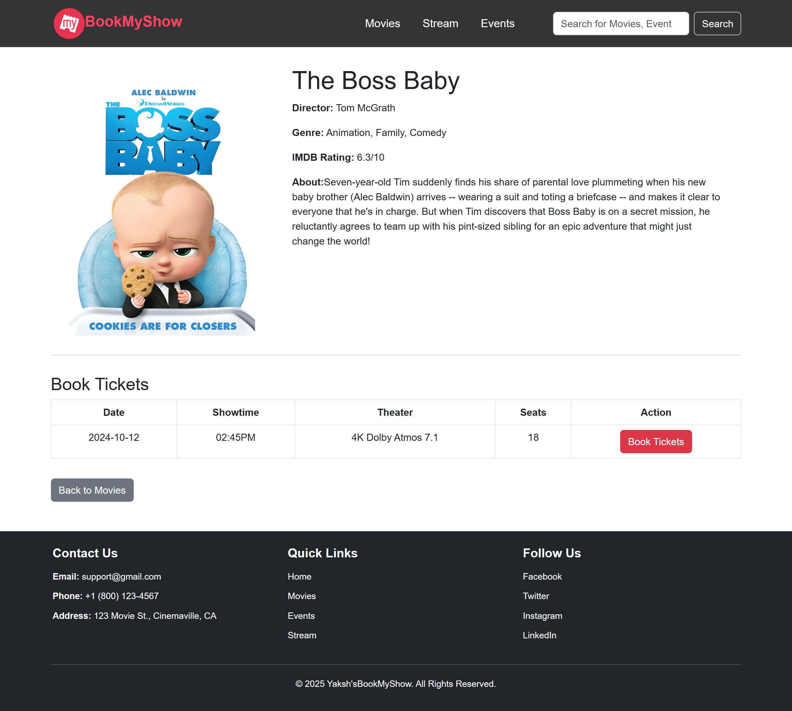
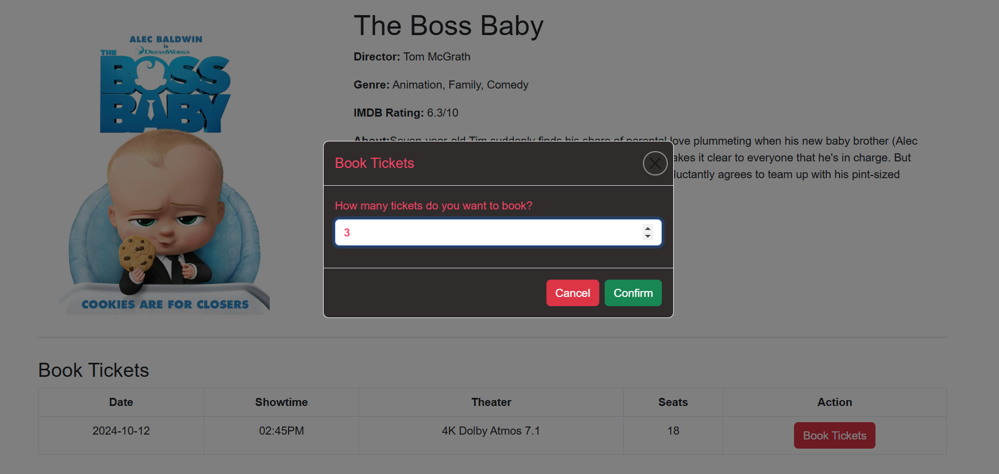

A simplified web-based application built using HTML, CSS, JavaScript, and Bootstrap 5 inspired by the popular ticket-booking platform, BookMyShow. The project features a responsive design with dynamic movie listings, detailed movie information, and a functional ticket booking system. Users can view available movies, check details, and book tickets via an animated modal. The application includes smooth animations, and a styled footer with contact and social links, making it a visually appealing and interactive project.

Screenshots of the output:
**Home Page:** This is the home page of the application. It features a navigation bar and movie tiles. Below the navigation bar, the text "Now Showing" is animated to slide from one end of the page to the other.

**Movie Details:** When the movie tile is clicked, a new age is opened, displaying the details of the particular movie, the show timings and ticket availability.

**Ticket Booking Modal:** This is a modal which opens when the book tickets button is pressed. It allows the user to give input and check for availability. If tickets are available booking is confirmed else an alert stating tickets not available is shown.
